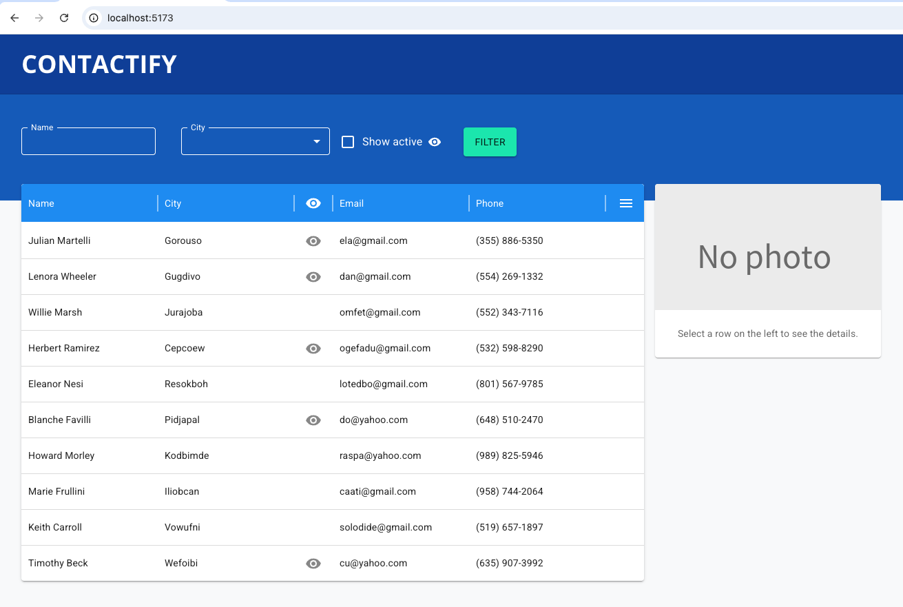
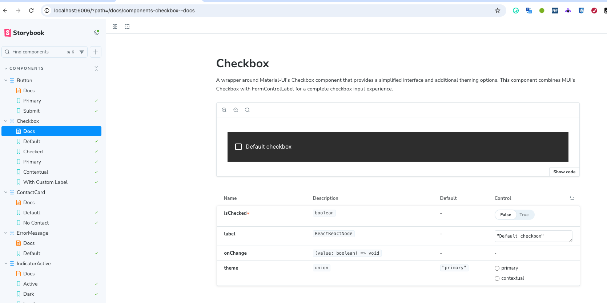

# Contactify app

This is an implementation of a [technical task](./docs/task-description.md) for a Front-End Position
The implementation consists of 2 parts:

- the application itself
- Storybook, which contains:
  - components demo in isolation
  - documentation articles

Quick links:

- [Selected approach motivation](./docs/approach-motivation.md)
- [Tech stack](./docs/tech-stack.md)

## Starting the app

Install the dependencies

`bun install`

(or a package manager of your choice, e.g. `npm install`, in all the commands below `bun` can be replaced with `npm` or `npm run`)

Start the app

`bun dev`

View the app locally [http://localhost:5173/](http://localhost:5173/)

### App preview

## Starting storybook

Make sure that the dependencies are already installed and run

`bun storybook`

### Storybook preview

## Running the tests

To run unit tests simply run `bun test`

To run e2e tests

Step1. Ensure that the app itself is running on http://localhost:5173/

Step2.

Run one of the commands:

- for interactive mode `bun cypress open`
- for command line mode `bun cypress run`
